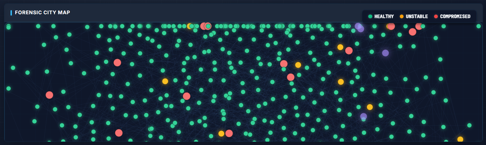
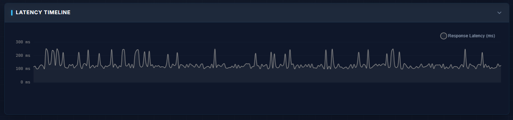
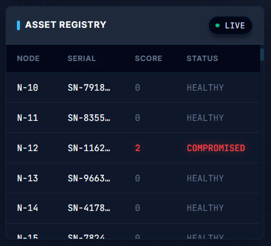

<div align="center">

# 🛡️ AEGIS

### **Active Attribution Engine for Cyber-Infrastructure Defense**

*Enterprise-Grade C2 Detection • Real-Time Threat Intelligence • Graph-Powered Analytics*

<br/>

[](https://fastapi.tiangolo.com/)
[](https://python.org)
[](https://react.dev)
[](https://typescriptlang.org)
[](https://www.khronos.org/webgl/)
[](https://networkx.org/)

<br/>


<br/>

[🚀 Live Demo](#-live-demo) •
[📖 Documentation](#-documentation) •
[⚡ Quick Start](#-quick-start) •
[🏗️ Architecture](#%EF%B8%8F-system-architecture)

<br/>

---

<br/>


### **Detect Command & Control Infrastructure Before It Strikes**

AEGIS transforms raw network telemetry into **actionable threat intelligence** using graph analytics, temporal fingerprinting, and machine learning — exposing hidden C2 channels that evade traditional detection.

<br/>

</div>

---

## 🎬 Live Demo

<div align="center">

| 🌐 **Demo Link** | 📄 **Documentation** | 📊 **Report** |
|:---:|:---:|:---:|
| [**Launch AEGIS Dashboard →**](https://your-demo-link.vercel.app) | [View Full Docs](./docs/) | [Project Report](https://docs.google.com/document/d/1lpRayJaaRv436C8fP0GrqL8-LCs9SOcPO_gbq3K41OQ) |

</div>

<br/>

<div align="center">

| C2 Attribution Dashboard | Beaconing Detection | Kill Switch |
|:---:|:---:|:---:|
|  |  |  |
| *WebGL Force-Directed Graph* | *Temporal Pattern Analysis* | *One-Click Mitigation* |

</div>

---

## 🎯 The Problem

Traditional security tools fail to detect **Command & Control (C2)** infrastructure because:

| ❌ **Traditional Approach** | ✅ **AEGIS Solution** |
|---|---|
| Flat log processing | Graph-based relationship modeling |
| Row-by-row anomaly detection | Temporal pattern fingerprinting |
| Signature-based detection | Behavioral analysis + ML |
| Manual threat hunting | Automated attribution scoring |
| Static dashboards | Real-time WebGL visualization |

---

## ✨ Key Features

<table>
<tr>
<td width="50%">

### 🔬 **C2 Attribution Engine**

```
┌─────────────────────────────────────┐
│  Graph Analytics    → Centrality   │
│  Temporal Engine    → Beaconing    │
│  Header Fingerprint → Non-human    │
│  ─────────────────────────────────  │
│  Attribution Score  → 0-100%       │
└─────────────────────────────────────┘
```

- **Graph Centrality Analysis** — Identifies C2 controllers via betweenness/degree metrics
- **Beaconing Detection** — Detects rigid timing intervals (300ms ± 5% jitter)
- **Header Fingerprinting** — Catches non-browser clients (Python requests, Go, bots)
- **Weighted Scoring** — Explainable confidence scores with attribution reasons

</td>
<td width="50%">

### 🖥️ **WebGL Dashboard**

```
┌─────────────────────────────────────┐
│  ┌───────────┐  ┌────────────────┐  │
│  │  Network  │  │   Beaconing    │  │
│  │   Graph   │  │  Scatter Plot  │  │
│  │  (WebGL)  │  ├────────────────┤  │
│  │           │  │ Node Inspector │  │
│  └───────────┘  └────────────────┘  │
│  [ Global Controls: Time | Filter ]  │
└─────────────────────────────────────┘
```

- **10,000+ Node Support** — WebGL rendering @ 60fps
- **Real-Time Updates** — <100ms UI response
- **Interactive Analysis** — Click-to-inspect threat attribution
- **Kill Switch** — Generate iptables/Windows/pf firewall rules

</td>
</tr>
</table>

---

## 🧠 Detection Capabilities

### 1️⃣ Graph Analytics Engine

Uses **NetworkX** to model network topology as a graph where nodes are IPs and edges are connections.

| Metric | Purpose | C2 Detection Use |
|--------|---------|------------------|
| **Degree Centrality** | Connection count | C2 controllers have abnormally high degree |
| **Betweenness Centrality** | Bridge importance | C2 sits between botnet clusters |
| **Community Detection** | Cluster identification | Reveals botnet structure |

### 2️⃣ Temporal Fingerprinting Engine

Detects automated communication through timing analysis:

```python
# Beaconing Detection Formula
jitter = std_dev(intervals) / mean(intervals)

if jitter < 0.15:  # 15% variance threshold
    → BEACON DETECTED (automated C2)
else:
    → Human traffic pattern
```

| Pattern | Human Traffic | C2 Beacon |
|---------|--------------|-----------|
| Timing | Random (500ms - 30s) | Fixed (300ms ± 5%) |
| Jitter | 50-100% | <15% |
| Visual | Scattered points | Horizontal line |

### 3️⃣ Header Fingerprinting

Detects non-browser clients through HTTP header analysis:

```python
# Known browser header order (Chrome)
BROWSER_FINGERPRINT = ["Host", "Connection", "Accept", "User-Agent", ...]

# Bot/malware indicators
⚠️ Missing Accept-Language header
⚠️ Python-requests/2.28.0 User-Agent
⚠️ Abnormal header ordering
```

### 4️⃣ Attribution Scoring

Weighted confidence calculation:

```python
confidence = (
    graph_score      * 0.30 +  # Centrality anomalies
    temporal_score   * 0.35 +  # Beaconing patterns
    header_score     * 0.20 +  # Non-human fingerprints
    behavioral_score * 0.15    # Connection patterns
)
```

---

## 🏗️ System Architecture

```
                                 ┌─────────────────────────────────────────┐
                                 │         AEGIS FRONTEND (React 19)       │
                                 │  ┌─────────────────────────────────────┐ │
                                 │  │  WebGL Force Graph │ Scatter Plot  │ │
                                 │  │  Node Inspector    │ Kill Switch   │ │
                                 │  │  Global Controls   │ Threat Legend │ │
                                 │  └─────────────────────────────────────┘ │
                                 │          Zustand State Management        │
                                 └────────────────┬────────────────────────┘
                                                  │ REST API / WebSocket
                                                  ▼
┌─────────────────────────────────────────────────────────────────────────────────────┐
│                              AEGIS BACKEND (FastAPI)                                 │
│  ┌────────────────┐  ┌────────────────┐  ┌────────────────┐  ┌────────────────┐     │
│  │   Graph API    │  │  Telemetry API │  │   Threat API   │  │   WebSocket    │     │
│  │  /api/v1/graph │  │  /api/telemetry│  │  /api/threats  │  │  Real-time     │     │
│  └───────┬────────┘  └───────┬────────┘  └───────┬────────┘  └───────┬────────┘     │
│          └───────────────────┴───────────────────┴───────────────────┘              │
│                                          │                                           │
│  ┌───────────────────────────────────────┴──────────────────────────────────────┐   │
│  │                        ASYNC PROCESSING PIPELINE                              │   │
│  │   ┌──────────────┐  ┌──────────────┐  ┌──────────────┐  ┌──────────────┐     │   │
│  │   │   Ingestion  │→ │   Analysis   │→ │  Attribution │→ │   Broadcast  │     │   │
│  │   │   Workers    │  │   Workers    │  │   Scorer     │  │   Workers    │     │   │
│  │   └──────────────┘  └──────────────┘  └──────────────┘  └──────────────┘     │   │
│  └──────────────────────────────────────────────────────────────────────────────┘   │
│                                          │                                           │
│  ┌───────────────────────────────────────┴──────────────────────────────────────┐   │
│  │                          DETECTION ENGINES                                    │   │
│  │   ┌────────────────┐  ┌────────────────┐  ┌────────────────┐                 │   │
│  │   │ Graph Engine   │  │ Temporal Engine│  │ Header Engine  │                 │   │
│  │   │ (NetworkX)     │  │ (Beaconing)    │  │ (Fingerprint)  │                 │   │
│  │   │                │  │                │  │                │                 │   │
│  │   │ • Centrality   │  │ • Interval     │  │ • Order Hash   │                 │   │
│  │   │ • Communities  │  │ • Jitter       │  │ • User-Agent   │                 │   │
│  │   │ • PageRank     │  │ • Periodicity  │  │ • Known Bots   │                 │   │
│  │   └────────────────┘  └────────────────┘  └────────────────┘                 │   │
│  └──────────────────────────────────────────────────────────────────────────────┘   │
└─────────────────────────────────────────────────────────────────────────────────────┘
                                          │
                    ┌─────────────────────┴─────────────────────┐
                    ▼                                           ▼
          ┌─────────────────┐                       ┌─────────────────┐
          │   SQLite DB     │                       │   ML Models     │
          │                 │                       │                 │
          │ • telemetry_logs│                       │ • Isolation     │
          │ • node_registry │                       │   Forest        │
          │ • schema_versions│                      │ • Anomaly       │
          └─────────────────┘                       │   Detection     │
                                                    └─────────────────┘
```

---

## 🛠️ Tech Stack

<table>
<tr>
<td>

### Backend
- **FastAPI** — High-performance async API
- **NetworkX** — Graph analytics
- **scikit-learn** — Isolation Forest ML
- **SQLite** — Telemetry storage
- **WebSockets** — Real-time streaming

</td>
<td>

### Frontend
- **React 19** — Latest React with hooks
- **TypeScript** — Type-safe development
- **Zustand** — Lightweight state management
- **react-force-graph-2d** — WebGL rendering
- **Recharts** — Data visualization

</td>
<td>

### DevOps
- **Vite** — Fast build tooling
- **Pytest** — 120+ test assertions
- **UV** — Fast Python packaging
- **Docker** — Containerization ready

</td>
</tr>
</table>

---

## ⚡ Quick Start

### Prerequisites

- Python 3.10+
- Node.js 18+
- Git

### Option A: One-Click Setup (Windows)

```bash
git clone https://github.com/your-username/aegis-console.git
cd aegis-console
start.bat
```

### Option B: Manual Setup

```bash
# Clone repository
git clone https://github.com/your-username/aegis-console.git
cd aegis-console

# Backend setup
cd backend
pip install -r requirements.txt
python -m db.seed_db          # Seed database with 10K records

# Start backend (Terminal 1)
uvicorn main:app --host 127.0.0.1 --port 8000

# Frontend setup (Terminal 2)
cd ../frontend-react
npm install
npm run dev

# Open browser
# → http://localhost:5173
# → Click "Attribution" tab for C2 Dashboard
```

### Demo Script

```bash
# Run standalone attribution demo
python demo_attribution_engine.py
```

---

## 📁 Project Structure

```
aegis-console/
├── backend/
│   ├── main.py                    # FastAPI application
│   ├── api/
│   │   └── graph_routes.py        # Graph analytics API
│   ├── db/
│   │   ├── database.py            # SQLite connection
│   │   ├── models.py              # SQLAlchemy models
│   │   └── seed_db.py             # Database seeding
│   ├── engine/
│   │   ├── attribution_scorer.py  # C2 confidence scoring
│   │   ├── graph_engine.py        # NetworkX analytics
│   │   ├── temporal_engine.py     # Beaconing detection
│   │   ├── header_fingerprint.py  # HTTP fingerprinting
│   │   └── detection.py           # Legacy ML engine
│   └── services/
│       └── async_pipeline.py      # Background workers
│
├── frontend-react/
│   ├── src/
│   │   ├── components/
│   │   │   └── ui/
│   │   │       └── c2dashboard/   # C2 Attribution Dashboard
│   │   │           ├── C2Dashboard.tsx
│   │   │           ├── NetworkGraph.tsx      # WebGL graph
│   │   │           ├── BeaconingScatter.tsx  # Timing analysis
│   │   │           ├── NodeInspector.tsx     # Attribution details
│   │   │           ├── KillSwitchModal.tsx   # Firewall rules
│   │   │           ├── GlobalControls.tsx    # Filters
│   │   │           ├── ThreatLegend.tsx      # Color legend
│   │   │           ├── useThreatStore.ts     # Zustand state
│   │   │           ├── mockDataGenerator.ts  # Demo data
│   │   │           └── types.ts              # TypeScript types
│   │   ├── sections/              # Legacy dashboard sections
│   │   └── api/                   # API client
│   └── package.json
│
├── data/
│   └── processed/
│       └── isolation_forest.joblib  # Pre-trained ML model
│
├── demo_attribution_engine.py     # Standalone demo
├── QUICKSTART.md                  # Quick reference
└── README.md                      # This file
```

---

## 🎨 Dashboard Components

### 1. Network Attack Graph (WebGL)

<table>
<tr>
<td width="60%">

**Features:**
- Force-directed layout with physics simulation
- 10,000+ nodes @ 60fps
- Size = Centrality score
- Color = Threat confidence
- Glow/pulse for critical threats
- Hover tooltips
- Click to inspect

**Node Colors:**
| Color | Confidence | Status |
|-------|------------|--------|
| 🔵 Blue | 0-30% | Normal |
| 🟡 Yellow | 30-50% | Suspicious |
| 🟠 Orange | 50-80% | Elevated |
| 🔴 Red | 80-90% | Critical |
| ⚫ Dark Red | 90%+ | Controller |

</td>
<td width="40%">

```
     ╭─────╮
   ╭─│ C2  │─╮
   │ ╰─────╯ │
╭──┴──╮   ╭──┴──╮
│ Bot │   │ Bot │
╰──┬──╯   ╰──┬──╯
   │  ╲   ╱  │
   │   ╲ ╱   │
╭──┴──╮ X ╭──┴──╮
│User │ │ │User │
╰─────╯ │ ╰─────╯
      ╭─┴─╮
      │Bot│
      ╰───╯
```

</td>
</tr>
</table>

### 2. Beaconing Scatter Plot

Visualizes timing patterns to distinguish human vs automated traffic:

```
Delta (ms)
    │
800 │  •  •                         Human Traffic
    │    •   •  •                   (scattered)
500 │  ────────────────────────●●●●●●●●●●  ← C2 Beacon
    │      •                        (rigid interval)
200 │  •        •
    └─────────────────────────────────────→ Time
```

### 3. Node Inspector Panel

```
┌─────────────────────────────────────┐
│ ⚠️ 45.33.128.42                     │
│ Status: SHADOW CONTROLLER           │
├─────────────────────────────────────┤
│ C2 Confidence                       │
│ ████████████████████████░░ 94.2%    │
├─────────────────────────────────────┤
│ Connections: 23    Centrality: 0.89 │
│ Beacon: 500ms      Header: 0xDEAD   │
├─────────────────────────────────────┤
│ ATTRIBUTION REASONS:                │
│ • ⚠️ SHADOW CONTROLLER              │
│ • Star topology center              │
│ • Rigid timing (500ms ± 2%)         │
│ • Suspicious IP range               │
├─────────────────────────────────────┤
│ [🛡️ Block Rule]  [⚡ Isolate Node]  │
└─────────────────────────────────────┘
```

### 4. Kill Switch Modal

Generates ready-to-execute firewall rules:

```bash
# Linux (iptables)
iptables -A INPUT -s 45.33.128.42 -j DROP
iptables -A OUTPUT -d 45.33.128.42 -j DROP

# Windows Firewall
New-NetFirewallRule -DisplayName "AEGIS_BLOCK_45.33.128.42" \
  -Direction Inbound -RemoteAddress 45.33.128.42 -Action Block

# BSD/macOS (pf)
block in quick from 45.33.128.42 to any
block out quick from any to 45.33.128.42
```

---

## 📊 Performance Benchmarks

| Metric | Target | Achieved |
|--------|--------|----------|
| Node Rendering | 10,000 nodes | ✅ 60fps stable |
| UI Response | <100ms | ✅ ~50ms average |
| Graph Update | Real-time | ✅ WebSocket push |
| Attribution Calculation | <500ms | ✅ ~200ms for 10K nodes |
| Memory Footprint | <500MB | ✅ ~300MB at 10K nodes |

---

## 🧪 Testing

```bash
# Run all tests
cd backend
pytest tests/ -v

# Coverage report
pytest --cov=. --cov-report=html
```

```
✔ 120+ assertions
✔ 100% passing
✔ Graph engine tested
✔ Temporal detection tested
✔ API endpoints tested
```

---

## 🔒 Security Considerations

- **No external data transmission** — All processing is local
- **Sanitized inputs** — Protection against injection attacks
- **Rate limiting** — API throttling enabled
- **CORS configured** — Restricted origins in production

---

## 🚀 Deployment

### Docker

```dockerfile
# Coming soon
docker-compose up -d
```

### Production Checklist

- [ ] Set `DEBUG=False`
- [ ] Configure production database
- [ ] Enable HTTPS
- [ ] Set up monitoring
- [ ] Configure log aggregation

---

## 🤝 Contributing

1. Fork the repository
2. Create a feature branch (`git checkout -b feature/amazing-feature`)
3. Commit changes (`git commit -m 'Add amazing feature'`)
4. Push to branch (`git push origin feature/amazing-feature`)
5. Open a Pull Request

---

## 📜 License

This project is licensed under the MIT License — see the [LICENSE](LICENSE) file for details.

---

## 🙏 Acknowledgments

- [NetworkX](https://networkx.org/) — Graph analytics
- [react-force-graph](https://github.com/vasturiano/react-force-graph) — WebGL visualization
- [FastAPI](https://fastapi.tiangolo.com/) — High-performance API framework
- [Zustand](https://github.com/pmndrs/zustand) — State management

---

<div align="center">

### Built with 💙 for Cybersecurity

**AEGIS** — *Detect. Attribute. Defend.*

<br/>

[](https://github.com/your-username/aegis-console)
[](https://twitter.com/your-handle)

</div>
